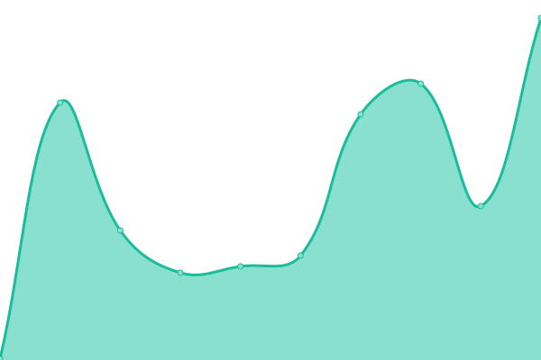
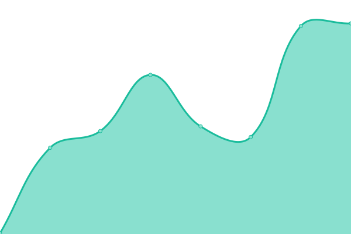

# [📈 Live Status](https://binzcodes.github.io/upptime): <!--live status--> **🟩 All systems operational**

This repository contains the open-source uptime monitor and status page for [Binzi](rbi.nz), powered by [Upptime](https://github.com/upptime/upptime).

With [Upptime](https://upptime.js.org), you can get your own unlimited and free uptime monitor and status page, powered entirely by a GitHub repository. We use [Issues](https://github.com/binzcodes/upptime/issues) as incident reports, [Actions](https://github.com/binzcodes/upptime/actions) as uptime monitors, and [Pages](https://binzcodes.github.io/upptime) for the status page.

<!--start: status pages-->
<!-- This summary is generated by Upptime (https://github.com/upptime/upptime) -->
<!-- Do not edit this manually, your changes will be overwritten -->
<!-- prettier-ignore -->
| URL | Status | History | Response Time | Uptime |
| --- | ------ | ------- | ------------- | ------ |
|  [Main](https://rbi.nz) | 🟩 Up | [main.yml](https://github.com/binzcodes/upptime/commits/HEAD/history/main.yml) | 

 237ms
     
 | 

<a href="https://up.rbi.nz/history/main">99.82%</a>
    

|  [Main - binz.codes](https://binz.codes) | 🟩 Up | [main-binz-codes.yml](https://github.com/binzcodes/upptime/commits/HEAD/history/main-binz-codes.yml) | 

 557ms
     
 | 

<a href="https://up.rbi.nz/history/main-binz-codes">100.00%</a>
    

|  [Trianglish](https://trianglish.com) | 🟩 Up | [trianglish.yml](https://github.com/binzcodes/upptime/commits/HEAD/history/trianglish.yml) | 

 478ms
     
 | 

<a href="https://up.rbi.nz/history/trianglish">100.00%</a>
    

|  [End of Treatment Bells](https://endoftreatmentbells.com) | 🟩 Up | [end-of-treatment-bells.yml](https://github.com/binzcodes/upptime/commits/HEAD/history/end-of-treatment-bells.yml) | 

 329ms
     
 | 

<a href="https://up.rbi.nz/history/end-of-treatment-bells">99.80%</a>
    

<!--end: status pages-->

[**Visit our status website →**](https://binzcodes.github.io/upptime)

## 📄 License

- Powered by: [Upptime](https://github.com/upptime/upptime)
- Code: [MIT](./LICENSE) © [Anand Chowdhary](https://anandchowdhary.com), supported by [Pabio](https://pabio.com)
- Data in the `./history` directory: [Open Database License](https://opendatacommons.org/licenses/odbl/1-0/)
